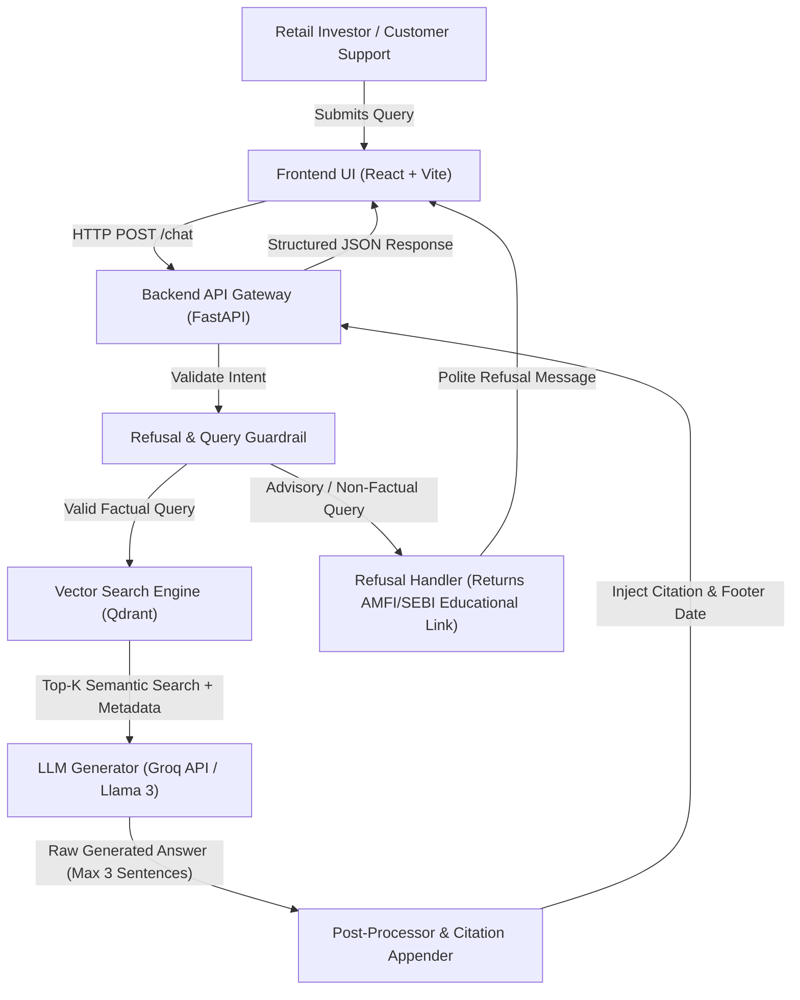
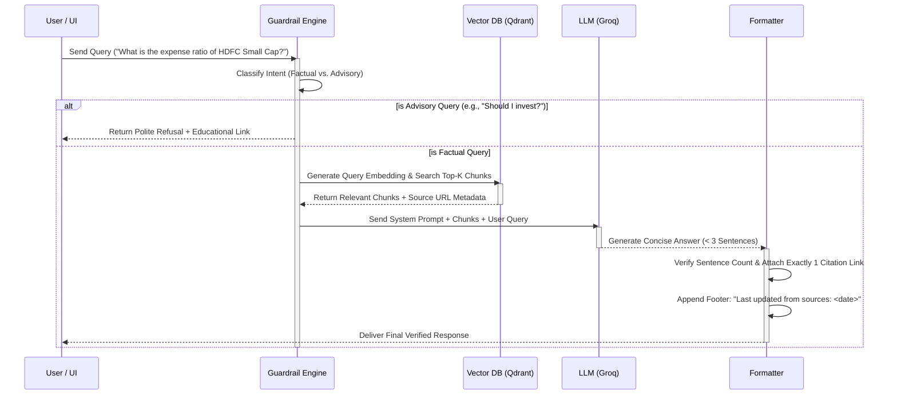

# Mutual Fund FAQ Assistant: System Architecture & Technical Specification

## 1. Executive Summary
The **Mutual Fund FAQ Assistant** is an enterprise-grade, lightweight Retrieval-Augmented Generation (RAG) system designed to deliver **facts-only, verifiable answers** regarding 5 selected HDFC Mutual Fund schemes on Groww. 

The architecture strictly enforces compliance by removing any advisory or speculative capabilities, enforcing concise response formatting (maximum 3 sentences), ensuring mandatory citation of official public sources, and automating scheduled synchronization of the corpus.

---

## 2. Recommended Technology Stack

| Layer | Technology Choice | Justification & Purpose |
| :--- | :--- | :--- |
| **Frontend UI** | **React + Vite + Tailwind CSS** | Delivers a responsive, lightweight, and modern UI. Easily implements required UI elements: Welcome Message, Example Queries, and the persistent Legal Disclaimer. |
| **Backend API** | **FastAPI (Python 3.11+)** | High-performance asynchronous API framework with built-in validation (Pydantic), ideal for handling streaming LLM responses and modular RAG pipelines. |
| **LLM & Orchestration** | **LlamaIndex / LangChain + Groq API** | Orchestrates chunking, embedding generation, retrieval, and prompt guardrails. Groq provides ultra-fast inference and strict adherence to formatting constraints. |
| **Embedding Model** | **BGE (BAAI General Embedding)** | Uses BAAI/bge-large-en-v1.5 or bge-base-en-v1.5 for generating high-quality semantic vector embeddings. |
| **Vector Database** | **Qdrant (or ChromaDB)** | High-speed similarity search engine with robust metadata filtering capabilities (filtering by scheme name, document type, and source URL). |
| **Scraper & Ingestion** | **Playwright + BeautifulSoup4 + PyPDF** | Crawls the 5 primary Groww scheme URLs and extracts text/tables from official PDF factsheets, KIMs, SIDs, and AMFI/SEBI guidance pages without data corruption. |
| **Automation / Scheduler** | **APScheduler (Python) / Cron** | Executes background tasks in the end phase to periodically re-verify public sources, update embedded chunks, and refresh the system's "last updated" timestamp. |

---

## 3. System Architecture & Flow Charts

### 3.1 High-Level System Architecture
The diagram below illustrates how frontend requests interact with the backend API, the refusal guardrails, the vector store, and the language model.

---

### 3.2 Automated Ingestion & Synchronization Pipeline (Scheduler Flow)
This pipeline operates asynchronously in the background to ensure the RAG corpus remains accurate, up to date, and strictly tied to official public sources.

```mermaid
graph LR
    Scheduler["Background Scheduler (APScheduler)"]
    Scraper["Web Scraper & PDF Downloader (Playwright / PyPDF)"]
    Cleaner["Text Normalizer & Table Extractor"]
    Chunker["Semantic Document Chunker"]
    Embedder["Embedding Model (BGE: bge-large-en-v1.5)"]
    VectorDB["Vector Database (Qdrant)"]
    MetaStore["Metadata Store (Source URLs & Timestamp)"]

    Scheduler -->|"Triggers Scheduled Sync (e.g., Daily/Weekly)"| Scraper
    Scraper -->|"Crawl 5 Groww Scheme URLs + Official AMC/SEBI Docs"| Cleaner
    Cleaner -->|"Raw Text & Structured Tables"| Chunker
    Chunker -->|"Text Chunks (approx. 300-500 tokens)"| Embedder
    Embedder -->|"Vector Embeddings"| VectorDB
    Chunker -->|"Attach Source URL & Scrape Date"| MetaStore
    MetaStore -->|"Link Metadata to Embeddings"| VectorDB
```

---

### 3.3 RAG Query Processing & Refusal Handling Flow
The internal logic executed by the backend for every incoming user query to guarantee zero advisory bias and 100% factual accuracy.

---

## 4. Detailed Component Breakdown

### 4.1 Ingestion Engine & Corpus Processing
- **Source Target:** 5 HDFC Mutual Fund scheme URLs on Groww, along with linked AMC factsheets, SIDs (Scheme Information Documents), KIMs (Key Information Memorandums), and AMFI/SEBI regulatory download guides.
- **Chunking Strategy:** 
  - **Table-Preserving Chunking:** Financial metrics (expense ratios, exit loads, minimum SIP amounts, fund managers) are extracted with table boundaries preserved so numerical associations are never split across chunks.
  - **Metadata Tagging:** Every generated chunk is strictly tagged with:
    - `scheme_name` (e.g., `"HDFC Small Cap Fund Direct Growth"`)
    - `document_type` (e.g., `"Factsheet"`, `"KIM"`, `"SID"`, `"Web FAQ"`)
    - `source_url` (The exact public URL where the chunk originated)
    - `last_updated` (The ISO-8601 timestamp of when the scraper verified the data)

### 4.2 Retrieval & Refusal Guardrail Engine
- **Intent Classifier:** A lightweight rule-based and LLM-powered classification layer that evaluates queries before retrieval:
  - **Blocked Advisory Keywords/Intents:** `"best fund"`, `"should I buy"`, `"recommend"`, `"compare returns"`, `"will it go up"`, `"good investment"`.
  - **Action upon Blocking:** Immediate refusal response without querying the vector store:
    > *"I am a facts-only assistant and cannot provide investment advice, opinions, or fund recommendations. For guidance on mutual fund investing, please visit the official [AMFI Investor Education Portal](https://www.amfiindia.com/) or consult a SEBI-registered investment advisor."*
- **Vector Retrieval:** Performs similarity search retrieving the top 3–5 most relevant chunks. Filters can be applied if the user explicitly names one of the 5 HDFC schemes.

### 4.3 Generation & Formatting Guardrails
To satisfy strict operational constraints, the LLM System Prompt enforces rigid boundaries:
1. **Sentence Limit Constraint:** The LLM is instructed to answer in **3 sentences or fewer**. A post-processing regex validation truncates or regenerates output if it exceeds 3 sentences.
2. **Single Citation Injection:** The formatter extracts the primary `source_url` from the top-ranked retrieved chunk and appends it formatted as a markdown link or structured UI element.
3. **Mandatory Footer:** Automatically attaches `Last updated from sources: <date>` using the metadata timestamp stored in the retrieved chunk.

---

## 5. Security, Privacy & Compliance Layer
- **No PII Collection:** The frontend UI contains no input fields for sensitive personal data. The backend explicitly scrubs and ignores any alphanumeric strings resembling PAN cards (`[A-Z]{5}[0-9]{4}[A-Z]{1}`), Aadhaar numbers (`\d{12}`), bank account numbers, OTPs, emails, or phone numbers.
- **No Session Storage:** Conversations are stateless or ephemeral. No user chat histories are stored in databases.
- **UI Disclaimer Enforcement:** A prominent, non-dismissible banner is displayed at the top and bottom of the chat interface:
  > **⚠️ DISCLAIMER:** *Facts-only. No investment advice. This assistant retrieves objective data from official public sources and does not provide financial or investment recommendations.*

---

## 6. Automation & Background Scheduler (End Phase)
To keep the facts-only assistant accurate without requiring manual intervention, an automated background scheduler will be integrated:
- **Framework:** `APScheduler` embedded within the FastAPI backend (or a dedicated Python worker container).
- **Execution Interval:** Weekly (or triggered on AMC factsheet monthly release schedules).
- **Workflow:**
  1. Re-scrape the 5 Groww scheme URLs and check for updated PDF factsheets or SIDs.
  2. Compute document checksums (MD5/SHA256) to detect whether official documents have changed.
  3. If changes are detected, re-chunk and re-embed the updated sections into Qdrant.
  4. Update the `last_updated` timestamp in the metadata store so subsequent user queries reflect the freshest publication date.
